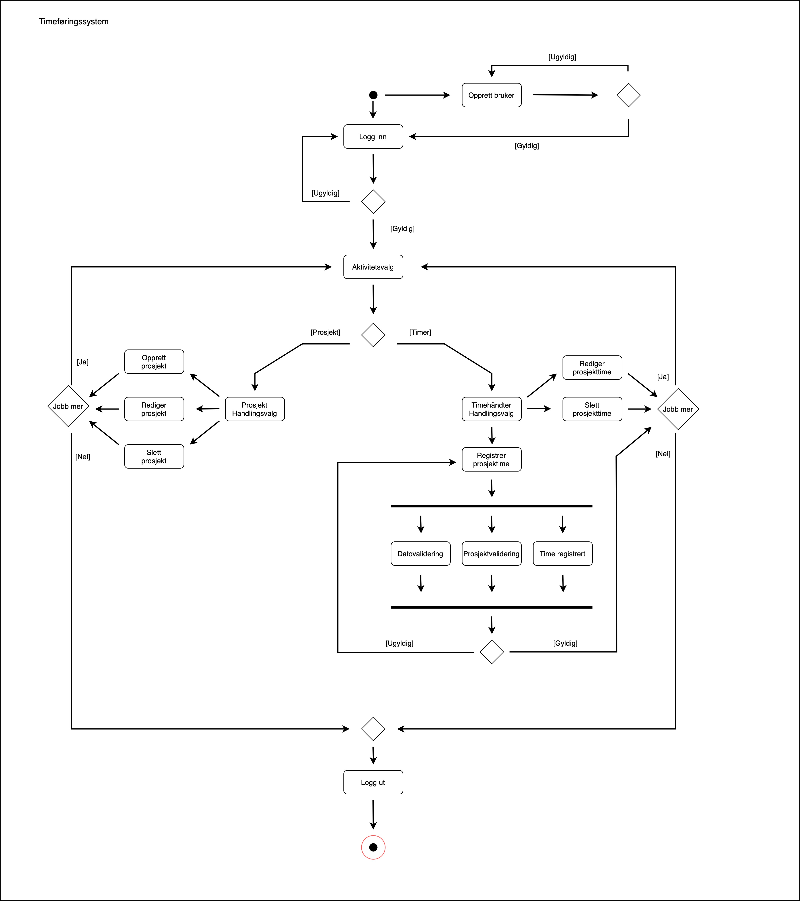

## Timeføringssytem

Vi er en gruppe som har designet og utviklet en applikasjon tiltenkt små bedrifter, som forenkler og effektiviserer prosessen med å registrere og administrere arbeidstimer til ansatte opp mot prosjekter.

### Getting Started

Repository inneholder startkoden hvor det er benyttet [Springboot](https://spring.io/projects/spring-boot) rammeverk, og hvor det er organisert inn i et [Maven](https://maven.apache.org/) prosjekt. Man kan importere prosjektet til en IDE som for eksempel Eclipse eller Intellij.

- Importing into Eclipse: Use `File -> Import -> Maven -> Existing Maven Projects` to import the startcode project
- Importing into IntelliJ: Use `File -> New -> Project From Existing Sources` to import the startcode project


### Utforming og modeller

#### Brukstilfellediagram
.jpg)

#### Aktivitetsdiagram



## Running the tests

Explain how to run the automated tests for this system

### Break down into end to end tests

Explain what these tests test and why

```
Give an example
```

### And coding style tests

Explain what these tests test and why

```
Give an example
```

## Deployment

Add additional notes about how to deploy this on a live system

## Built With

* [Dropwizard](http://www.dropwizard.io/1.0.2/docs/) - The web framework used
* [Maven](https://maven.apache.org/) - Dependency Management
* [ROME](https://rometools.github.io/rome/) - Used to generate RSS Feeds

## Contributing

Please read [CONTRIBUTING.md](https://gist.github.com/PurpleBooth/b24679402957c63ec426) for details on our code of conduct, and the process for submitting pull requests to us.

## Versioning

We use [SemVer](http://semver.org/) for versioning. For the versions available, see the [tags on this repository](https://github.com/your/project/tags). 

## Authors

* **Billie Thompson** - *Initial work* - [PurpleBooth](https://github.com/PurpleBooth)

See also the list of [contributors](https://github.com/your/project/contributors) who participated in this project.

## License

This project is licensed under the MIT License - see the [LICENSE.md](LICENSE.md) file for details

## Acknowledgments

* Hat tip to anyone whose code was used
* Inspiration
* etc
