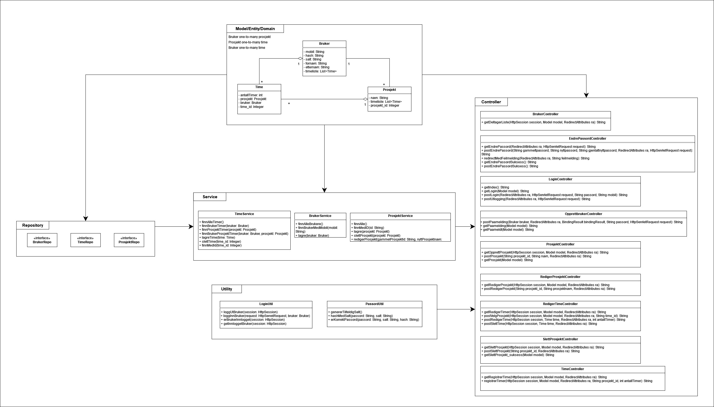

## Timeføringssytem

Vi er en gruppe som har designet og utviklet en applikasjon tiltenkt små bedrifter, som forenkler og effektiviserer prosessen med å registrere og administrere arbeidstimer til ansatte opp mot prosjekter.

### Oppstart informasjon

Repository inneholder startkoden hvor det er benyttet [Springboot](https://spring.io/projects/spring-boot) rammeverk, og hvor det er organisert inn i et [Maven](https://maven.apache.org/) prosjekt. Man kan importere prosjektet til en IDE som for eksempel Eclipse eller Intellij.

- Importing into Eclipse: Use `File -> Import -> Maven -> Existing Maven Projects` to import the startcode project
- Importing into IntelliJ: Use `File -> New -> Project From Existing Sources` to import the startcode project

### Utforming og modeller

#### Brukstilfellediagram
.jpg)

#### Aktivitetsdiagram

#### Sekvensdiagram

#### Klassediagram

### Funksjonalitet

- Ha et brukervennlig grensesnitt som gjør det enkelt for ansatte å forstå systemet og kunne
lett føre timer
- Oppretting av bruker, samt inn- og utlogging av tjeneste
- Opprette prosjekt
- Registrere arbeidstimer
- Administrering av system informasjon
  
