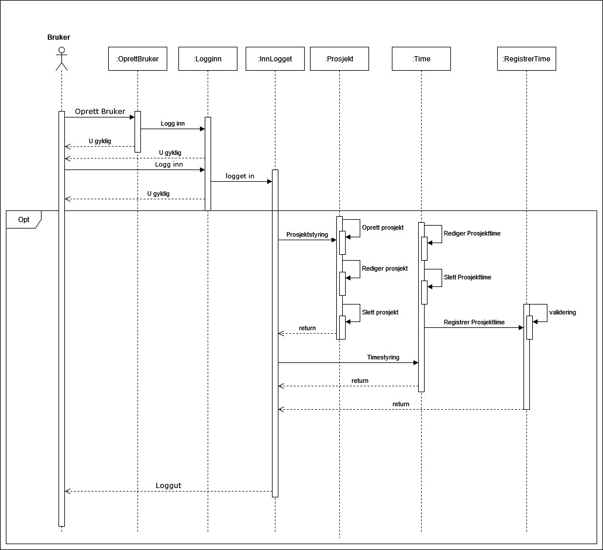

## Timeføringssytem

Vi er en gruppe som har designet og utviklet en applikasjon tiltenkt små bedrifter, som forenkler og effektiviserer prosessen med å registrere og administrere arbeidstimer til ansatte opp mot prosjekter.

### Oppstart informasjon

Repository inneholder startkoden hvor det er benyttet [Springboot](https://spring.io/projects/spring-boot) rammeverk, og hvor det er organisert inn i et [Maven](https://maven.apache.org/) prosjekt. Man kan importere prosjektet til en IDE som for eksempel Eclipse eller Intellij.

- Importing into Eclipse: Use `File -> Import -> Maven -> Existing Maven Projects` to import the startcode project
- Importing into IntelliJ: Use `File -> New -> Project From Existing Sources` to import the startcode project

Koden er koblet opp mot en postgreSQL database, hvor data om bruker, prosjekt og timer blir lagret. Dersom du ikke ønsker å opprette en bruker, selv med falsk info ;) kan du benytte deg av brukeren til Ola Normann.

 ```
Innlogging
Mobil: 90010100
Passord: 00000
NB! Passordet er fem nuller.
 ```
Dersom du ønsker å teste funksjonaliteten til å endre passord, plis skift tilbake igjen:)

### Utforming og modeller

#### Brukstilfellediagram
.jpg)

#### Aktivitetsdiagram


#### Sekvensdiagram


#### Klassediagram


### Funksjonalitet

- Ha et brukervennlig grensesnitt som gjør det enkelt for ansatte å forstå systemet og kunne
lett føre timer
- Oppretting av bruker, samt inn- og utlogging av tjeneste
- Opprette prosjekt
- Registrere arbeidstimer
- Administrering av system informasjon
- Endre bruker sitt passord

### Gruppen sin ettertanke
Når det gjelder samarbeidet og arbeidsflyt sitter vi igjen med gode opplevelser og et inntrykk
av at vi har hatt en velfungerende gruppe. Strukturen vi har hatt internt har også fungert bra,
og det har vært en lav terskel for å diskutere oppgaver og fremgangsmåter. Vi har hatt god
hjelp av hverandre og oppgaver og sprinter som har vært mulig å gjennomføre.
Arbeidsmodellen med å bygge smått med sten for sten har fungert bra, og gjort at vi kun har
søtt på noen få tilfeller av kode som ikke har fungert. Kommunikasjonen har jevnt over vært
bra, med unntak av noen enkelttilfeller av duplikatkode hvor to eller flere har tatt for seg
samme oppgave.

Oppgavenes størrelse har vært utfordrende å estimere og timene bruk har variert. Timebruken
har også vært preget av hvorvidt man har støtt på utfordringer. Foruten om ovennevnte
kommunikasjon og duplikatkode, så har vi støtt på utfordringer med deployment til Tomee-
serveren, samt visning av sider ved navigering i prosjektet fra serveren. Eksempelvis måtte vi
gjennom en downgrade av versjoner på både java og spring, noe som også fikk følger for
tidligere produsert kode. Dette gjorde at det ble noen timer ekstra på enkelte elementer, men
prosjektet og produktet har på tross av dette vært fungerende og oppe det meste av tiden. Et
element vi trodde kom til å bli en større utfordring var at alle skulle jobbe på samme master-
branch. Dette har for det meste gått bra og applikasjonen har hatt lite nedetid som følge av
kodefeil på master.

  
